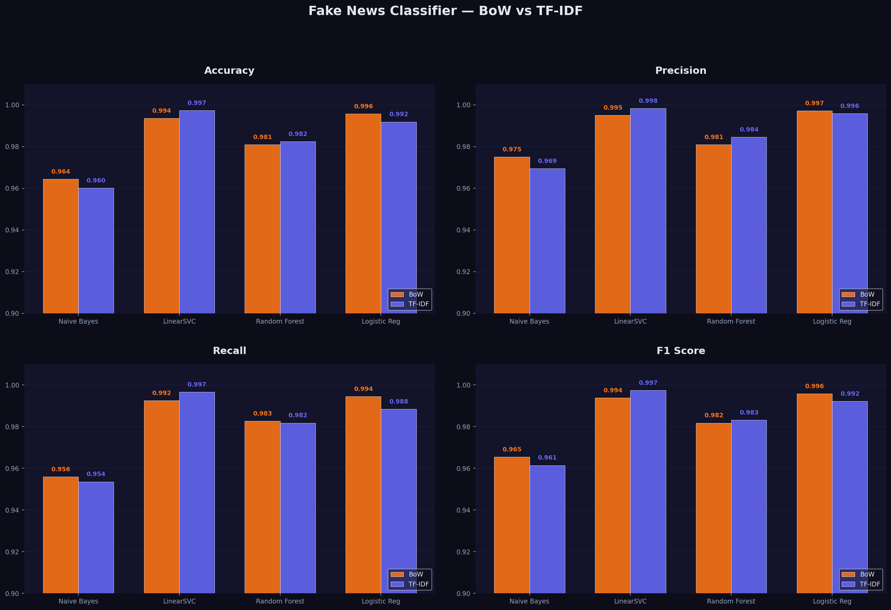

# Fake News Classifier📰

A Machine Learning project that detects fake news articles using Natural Language Processing (NLP).  
Trained on 44,000+ real-world news articles, comparing **Bag of Words** vs **TF-IDF** vectorization across four classifiers.

---

## Results

| Model | BoW Accuracy | TF-IDF Accuracy |
|-------|-------------|-----------------|
| Logistic Regression | 99.28% | ~99.5% |
| LinearSVC | 99.17% | ~99% |
| Random Forest | 97.20% | ~97% |
| Multinomial Naive Bayes | 95.81% | ~94% |

---

## Dataset

Kaggle — [Fake and Real News Dataset](https://www.kaggle.com/datasets/clmentbisaillon/fake-and-real-news-dataset)

| File | Articles | Label |
|------|----------|-------|
| `Fake.csv` | 23,481 | 0 (Fake) |
| `True.csv` | 21,417 | 1 (Real) |

Columns: `title`, `text`, `subject`, `date`

> Labels are not present in the original dataset — added manually at load time.

---

## Project Structure

```
fake-news-classifier/
│
├── News.ipynb              # Main notebook
├── Fake.csv                # Fake news articles
├── True.csv                # Real news articles
├── model_comparison.png    # BoW vs TF-IDF visualization
└── README.md
```

---

## Pipeline

```
Load Data → Add Labels → EDA → Merge & Shuffle
    → Combine Title + Text → Clean Text
        → Train/Test Split (80/20)
            → Vectorize (BoW + TF-IDF)
                → Train Models → Evaluate → Compare
```

---

## Steps

### 1. Data Loading & Labeling

```python
fake_df = pd.read_csv('Fake.csv')
true_df = pd.read_csv('True.csv')

fake_df['label'] = 0
true_df['label'] = 1

df = pd.concat([fake_df, true_df], axis=0)
df = df.sample(frac=1, random_state=42).reset_index(drop=True)
```

### 2. EDA

- Class distribution check
- Duplicate detection — 209 found and removed
- Subject-wise breakdown for Fake vs Real articles

### 3. Feature Engineering

```python
# Title + Text combined for richer signal
df['text'] = df['title'] + " " + df['text']
```

### 4. Text Preprocessing

```python
import re, string

def text_preprocess(text):
    text = text.lower()
    text = re.sub(r'\(reuters\)', '', text)
    text = re.sub(r'http\S+|www\S+', '', text)
    text = text.translate(str.maketrans('', '', string.punctuation))
    text = re.sub(r'[^a-z\s]', '', text)
    text = re.sub(r'\s+', ' ', text).strip()
    return text
```

> Lemmatization was skipped due to performance constraints on 44k articles.

### 5. Train-Test Split

```python
X_train, X_test, y_train, y_test = train_test_split(
    X, y, test_size=0.2, random_state=42, shuffle=True
)
# X_train: 35,751  |  X_test: 8,938
```

### 6. Vectorization

```python
# Bag of Words
bow = CountVectorizer(max_features=50000, ngram_range=(1,2), min_df=3, max_df=0.85)

# TF-IDF
tfidf = TfidfVectorizer(max_features=50000, ngram_range=(1,2),
                        min_df=3, max_df=0.85, sublinear_tf=True)
```

### 7. Models

```python
models = {
    'Multinomial NB'     : MultinomialNB(),
    'SVC'                : CalibratedClassifierCV(LinearSVC(max_iter=10000)),
    'Random Forest'      : RandomForestClassifier(n_estimators=50, max_depth=20, n_jobs=-1),
    'Logistic Regression': LogisticRegression(max_iter=1000, n_jobs=-1)
}
```

---

## Visualizations

- Subject distribution — Fake vs Real
- Confusion matrices for all 4 models
- ROC curves
- BoW vs TF-IDF grouped bar chart — Accuracy, Precision, Recall, F1



---

## Tech Stack

| Category | Libraries |
|----------|-----------|
| Data | `pandas`, `numpy` |
| NLP | `nltk`, `re`, `string` |
| ML | `scikit-learn` |
| Visualization | `matplotlib`, `seaborn` |

---

## Setup

```bash
# Clone the repo
git clone https://github.com/yourusername/fake-news-classifier.git
cd fake-news-classifier

# Install dependencies
pip install pandas numpy matplotlib seaborn scikit-learn nltk

# Download dataset from Kaggle and place Fake.csv + True.csv in root

# Run the notebook
jupyter notebook News.ipynb
```

---

## Key Takeaways

- Logistic Regression + TF-IDF gave the best results (~99.5% accuracy)
- Subject column dropped to avoid data leakage
- Reuters tag removal improved preprocessing quality
- Combining title + text outperforms using either field alone
- Default CountVectorizer produces 190k+ features — always set max_features

---

## Future Improvements

- [ ] Add lemmatization with batch processing
- [ ] GridSearchCV on best model
- [ ] Cross-validation for reliable evaluation
- [ ] BERT / Transformer-based classifier
- [ ] Top discriminative words analysis via LR coefficients
- [ ] Streamlit web app deployment

---
